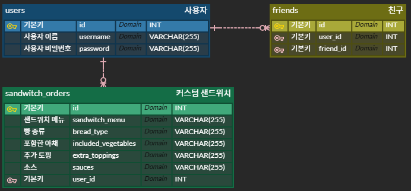

# 마이웨이(가제)

This project is a web application built using Node.js, Express, EJS, and MySQL. It allows users to create and manage their custom sandwich orders, add friends, and view friends' sandwich orders.

## 목차

- [기술스택](#기술스택)
- [개발기간](#개발기간)
- [기능](#기능)
- [데이터베이스](#데이터베이스)
- [고도화 방안](#고도화-방안)

## 기술스택
표로 정리하기
- 언어 : JavaScript, SQL
- 서버 : Express
- 프레임워크 : EJS(템플릿 엔진)
- DB : MySQL
- IDE : Visual Studio Code
- 패키지 : express, ejs, dotenv, express-session, mysql
- 코드 보조 도구(Code assistant tool) : Copilot(Free version)

## 개발기간

- 2025년 3월 24일 ~ 2025년 3월 25일

## 기능

- 사용자 인증 및 승인
- 커스텀 샌드위치 저장
- 친구 추가
- 친구의 커스텀 샌드위치 확인

## 데이터베이스

## 고도화 방안

- 사용자들이 많이 선택한 샌드위치 메뉴
- 인기 토핑 및 소스
- 자주 제외한 야채
- 테마별 추천 메뉴
    - 예) 다이어트 추천 메뉴